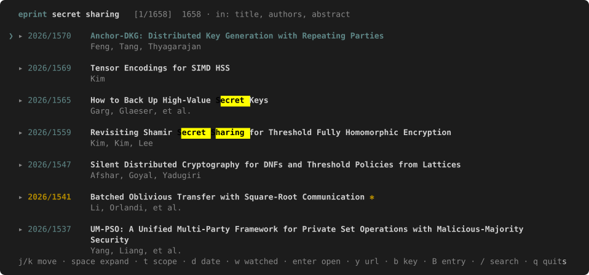

# eprint

Fast command-line search over the [IACR Cryptology ePrint Archive](https://eprint.iacr.org).

Metadata for all ~26,000 papers is harvested from the archive's OAI-PMH interface into a
local SQLite FTS5 index, so searching is instant and works offline.

```
$ eprint "threshold ecdsa" -n 3

3 of 62 results  in: title, authors, abstract · index 8m old

  2026/1455    Trout++: Robust Asynchronous Two-Round ECDSA for Arbitrary Thresholds
               Nof, Parker

  2026/1103    Jevil: A Catastrophic-Failure-by-Design Signature Scheme
               Kobeissi

  2026/976     Revisiting DKLs Threshold ECDSA: Enhanced OT-based VOLE and Two-Party Signing
               Asharov
```

Results are titles and authors, newest first — the second hit above matches in its abstract
rather than its title. Add `-a` for full abstracts, `-t` to match titles and authors only, or
`eprint show <id>` for one paper in full. For reading rather than looking something up, there is a
full-screen [interactive browser](#interactive-browser).

It can also keep up on its own: [desktop notifications](#desktop-notifications-and-a-launcher) when
a paper matching one of your [watches](#watches) appears, and the browser one ⌘Space away.

### Opening papers

On terminals that implement OSC 8 hyperlinks (iTerm2, Ghostty, kitty, WezTerm, VS Code,
recent GNOME Terminal), paper ids and titles are themselves clickable.

macOS **Terminal.app does not support OSC 8** — it only auto-detects plain text URLs. It is
detected automatically and a bare, cmd-clickable URL is printed under each result instead.
Force either behaviour with `--urls` / `--no-urls`.

`eprint open <id>` works everywhere regardless of terminal.

### Papers you open are kept

`eprint open <id>` goes straight to the PDF — the landing page is a detour, and `eprint show`
already holds the metadata it would have given you. Opening a paper is also taken as a signal
that you want it, so the tool quietly builds a local library at `~/Documents/eprint/`:

- **First open** — the PDF opens in your browser:

  ```
  $ eprint open 1523
  ⌘S anywhere in Downloads, Desktop or your home folder and it will be kept
  ```

  Press ⌘S (browsers display PDFs inline rather than downloading them) and accept whatever
  folder the dialog suggests — no navigating. Downloads, Desktop, your home folder and the
  library itself are all watched, because a browser suggests wherever it last saved and no
  command-line tool can change that. The file is filed as
  `2026-1523-catching-many-traitors.pdf`.
- **Every open after that** — the local PDF opens directly. Instant, offline, no browser.

The same applies to `enter` in `browse`, which shows the same hint in its status line. There are
no flags and no settings for this; the only visible difference is that the second open is
instant. Set `EPRINT_PAPERS_DIR` or `EPRINT_DOWNLOAD_DIR` if the defaults are wrong for you.

Filing is deliberately conservative. A download in a **watched folder** is only adopted if
it is named for the paper (ePrint serves `/YYYY/NNNN.pdf`, so browsers save `1523.pdf`), appeared
after you opened the paper, is not a partial download, starts with the `%PDF-` magic bytes, and
has stopped changing size. It is **copied**, not moved, so nothing vanishes from where you saved
it. `EPRINT_DOWNLOAD_DIR` replaces the watched set if your browser saves somewhere unusual.

A PDF saved into the **library folder** is treated as deliberate: it is renamed to the canonical
name and used, whenever it arrives — so saving there works even hours later, long after the
watcher has exited. A file whose name claims a different paper (`2025-1523-…`) is never served
for `2026/1523`, and a file that is not really a PDF is ignored.

Clicking an OSC 8 link in your terminal bypasses the tool entirely, so those opens cannot be
cached — use `eprint open` or `browse` if you want the local copy.

To drop a paper you are done with:

```sh
eprint open --rm 1499              # or several: --rm 1499 2026/1464
```

It names each file it deletes and reports what was freed, and it only ever touches the library
folder. Nothing is lost for good — opening the paper again fetches it back. The filenames are
canonical and readable precisely so that `rm ~/Documents/eprint/2026-1499-*.pdf` works just as
well if you would rather not go through the tool.

**The tool never downloads a PDF itself, by design.** The archive serves them behind a Cloudflare
challenge, and its `robots.txt` says *"Full text PDFs are only available under a license specific
to each paper"* while denying `*pdf` to every agent. Metadata is offered to machines over OAI-PMH;
full text is not. So your browser does the fetching, and this only files what your browser saved.

## Interactive browser

A full-screen reader for exploring the archive rather than looking one thing up.

<p align="center"></p>

```sh
eprint browse                      # everything, newest first
eprint browse "lattice signature"  # start from a query
eprint browse --author Boudgoust --date 2023..2024
```

Abstracts expand and collapse in place, matches stay highlighted inside the expanded text, and the
query can be edited live with `/`. There is no cap on how much it loads — a bare `eprint browse`
holds all ~26,000 papers and `G` really does reach the oldest one from 1996 — because only the rows
on screen are ever laid out. `-n` still exists if you want a smaller set.

| Key | Action |
|---|---|
| `j` / `k`, arrows | move |
| `g` / `G`, home / end | first / last |
| `ctrl-d` / `ctrl-u`, page keys | jump |
| `space` / `tab` | expand or collapse the abstract |
| `a` | expand or collapse everything |
| `t` | toggle where the query is matched: `in: title, authors, abstract` ⇄ `in: title, authors` |
| `d` | filter by date — same grammar as `--date`; empty clears it |
| `w` | show only papers matching a watch — searches apply within that subset |
| `/` | edit the query — results filter live as you type |
| `ctrl-u` | clear the query (while editing) |
| `enter` / `o` | open the PDF — your local copy once you have one |
| `y` | copy the URL to the clipboard |
| `b` | copy the CryptoBib citation key (published version when known) |
| `B` | copy the full BibTeX record |
| `q` / `esc` / `ctrl-c` | quit |

`/` refines the current query rather than replacing it, so you can narrow a search by
typing more terms; `ctrl-u` clears it to start fresh. Expansion is tracked per paper id, so
it survives re-searching. Typing is debounced: the query line updates on every keystroke, the
listing catches up once you pause, and a `…` next to the cursor means it has not caught up yet.

### Copying needs a clipboard tool on Linux

`y`, `b` and `B` shell out, because a terminal cannot write your clipboard by itself. macOS has
`pbcopy` built in; Linux does not ship anything by default, so install one:

```sh
sudo apt install wl-clipboard      # Wayland — the Ubuntu default session
sudo apt install xclip             # X11
```

`wl-copy`, `xclip` and `xsel` are all tried, in whichever order suits the session, so either
package is enough and having both is fine. If none is present the status line says so and names
the package rather than just reporting failure.

Terminals that implement OSC 52 (kitty, WezTerm, foot, Alacritty, tmux, and so over ssh) are used
as a last resort and need nothing installed. GNOME Terminal is not one of them — VTE has never
implemented it — which is why the packages above matter there.

Because nothing needs to be clicked, `browse` works identically on terminals without OSC 8
support — press `enter` instead.

## Install

Requires a Rust toolchain (1.86 or newer). If you do not have one:
<https://rustup.rs>

```sh
git clone https://github.com/msimkin/eprint.git
cd eprint
cargo install --path . --locked
```

That puts an `eprint` binary in `~/.cargo/bin`, which rustup already adds to your `PATH`,
so you can then run `eprint` from anywhere.

> **Use `--locked`.** `cargo install` ignores `Cargo.lock` unless you pass it. Without it
> Cargo re-resolves dependencies and pulls versions of `darling` and `instability` that
> require rustc 1.88, so the build fails on 1.86. The committed lockfile pins compatible
> versions. On rustc 1.88 or newer you can drop the flag, or run `cargo update` to lift the
> pins.

Check it worked:

```sh
eprint --version
```

The first search builds the local index automatically — about 30 seconds, once.

Switch on Tab completion while you are here (zsh or bash):

```sh
eprint config --completions
```

### Without installing

To run it from the build directory instead:

```sh
cargo build --release --locked
./target/release/eprint --help
```

### If `eprint` is not found

`~/.cargo/bin` is missing from your `PATH`. Add it to your shell's startup file:

```sh
# ~/.zshrc (zsh, the macOS default) or ~/.bashrc (bash)
export PATH="$HOME/.cargo/bin:$PATH"

# fish
fish_add_path ~/.cargo/bin
```

Then open a new shell. Alternatively, symlink the binary somewhere already on your `PATH`:

```sh
ln -s "$PWD/target/release/eprint" /usr/local/bin/eprint
```

### Updating and uninstalling

```sh
git pull && cargo install --path . --locked   # rebuild and replace
cargo uninstall eprint                        # remove the binary
```

Uninstalling leaves your index and config in place; see [Storage](#storage) to remove those
too.

## Use

```sh
eprint                                # papers that arrived since you last looked
eprint "threshold ecdsa"              # search
eprint "fully homomorphic" -a         # include full abstracts
eprint "Katharina Boudgoust" -t       # match titles and authors only
eprint garbled --date 2024 -n 50      # one year, more results
eprint --author Boudgoust --date 2y   # filter without a query
eprint --category "Public-key" -n 5   # filter by IACR category
eprint show 2026/1538                 # one paper in full
eprint open 2026/1538                 # the PDF — your local copy once you have one
eprint open                           # list the papers you have downloaded
eprint open --rm 1538                 # delete a downloaded copy
eprint watch add "lattice OR LWE"     # mark matching papers with a ✱ everywhere
eprint bib 2018/116 --entry           # the whole BibTeX record
eprint status                         # index stats
eprint update                         # refresh now
eprint update --full                  # rebuild from scratch
eprint update --quiet                 # refresh with no progress output
eprint config --completions           # switch on Tab completion (zsh or bash)
```

Every short flag has a long form: `-n` is `--limit`, `-a` is `--abstracts`, `-t` is `--title`.

A query is just the first argument, so `eprint search <query>` and `eprint <query>` are the same
thing; `search` is kept for the fingers that expect it. `new` and `Bib` are not — those words are
now ordinary query terms.

## Tab completion (zsh and bash)

```sh
eprint config --completions      # adds one line to your shell's rc file
```

It reads `$SHELL`, writes to `~/.zshrc` or `~/.bashrc` accordingly, is idempotent, tells you the
file it touched, and does nothing if the line is already there. `eprint config` reports whether
completion is on. To do it by hand instead:

```sh
echo 'eval "$(eprint completions zsh)"'  >> ~/.zshrc
echo 'eval "$(eprint completions bash)"' >> ~/.bashrc
```

Either way that one line is enough even on a bare rc file: the function ships inside the binary.
Under zsh it initialises the completion system itself if your shell has not already done so —
without that, `compdef` is undefined and Tab does nothing **anywhere**, not just for `eprint`, which
is a confusing way to discover that your shell never ran `compinit`. The bash function needs no
such bootstrap, and deliberately depends on nothing outside bash itself: not the `bash-completion`
package, and no syntax newer than bash 3.2.

The two are not quite equal. Bash has no description column, so where zsh shows a paper's title or
an author's paper count beside each candidate, bash can only offer the value. Everything else — the
commands, the per-command flags, paper ids, categories, authors, watch numbers, and the
`--flag=value` form — completes the same in both, case-insensitively in both.

`eprint open <TAB>` then offers the papers you have already downloaded, with their titles:

```
$ eprint open <TAB>
2026/1464  -- Optimal Distributed Monotone-Policy Encryption for DNFs and More from Lattices
2026/1499  -- BF²: A Bloom-Filtered Brute-Force Framework for Multi-Target Password Recovery
2026/1523  -- Catching Many Traitors in Threshold Traitor Tracing: Lower Bounds and Constructions
```

`show` and `bib` complete the same set, `eprint <TAB>` the commands, `eprint watch <TAB>` its three
verbs. Typing an id that is not in the library still works — it just opens online, as always.

**`--category <TAB>` offers the archive's categories** — there are only seven, nobody remembers their
exact wording, and they are the one filter you cannot guess:

```
$ eprint watch add --category <TAB>
Applications               -- 2030 papers
Attacks and cryptanalysis  -- 1281 papers
Cryptographic protocols    -- 6224 papers
Foundations                -- 3090 papers
Implementation             -- 2364 papers
Public-key cryptography    -- 4792 papers
Secret-key cryptography    -- 2885 papers
```

The list is read from your index rather than baked into the binary, so a category the archive adds
shows up without a new release, and the counts tell you whether a filter is worth having. Any
substring works too — `--category proto` is the same filter — and a name with a space is quoted for
you as you complete it. This works wherever `--category` does: searches, `browse` and `watch add`.

**`--author <TAB>`** completes names out of the index once you have typed a few letters — the full
list is 19,540 names, so it narrows rather than dumps. Names are offered in both orders, since
completion matches on a prefix and you may start from either end:

```
$ eprint watch add --author boudg<TAB>
Boudgoust, Katharina  -- 18 papers
Boudguiga, Aymen      -- 13 papers

$ eprint watch add --author Katharina\ B<TAB>      → Katharina\ Boudgoust
```

`Boudgoust, Katharina` and `Katharina Boudgoust` are the same filter — the comma is there only so
the candidate starts with what you typed, and the space is escaped for you. Candidates are always
people, never bare surnames, and spellings that differ by accents, punctuation or spacing are shown
as one person with their papers added together.

**`eprint watch rm <TAB>`** offers your saved watches by number, with what each one is:

```
$ eprint watch rm <TAB>
1  -- by Boudgoust
2  -- lattice OR LWE
3  -- in Foundations
```

Those numbers are positions that renumber after every removal, so having them listed beats counting
by hand. `--scope` and `--theme` complete their values too, and **flag names complete as well** —
`eprint lattice -<TAB>` lists what a search takes, `eprint bib -<TAB>` what `bib` takes. Both
`--category <value>` and `--category=<value>` are understood.

Completion ignores case everywhere, like the filters themselves: `--author shamir<TAB>` and
`--category crypto<TAB>` work as well as the capitalised forms. Names insert with the archive's own
capitalisation but without accents, since a shell cannot reach `Damgård` from a typed `damga`; the
description beside the candidate shows the real spelling when the two differ.

Changing completion means starting a new shell, or `exec $SHELL` — the function is loaded once when the
shell starts, so an already-open terminal keeps the version it read at login.

Paper ids complete from your **library**, not the whole archive: a short changing list is what
completion is good at, and 26,000 candidates would mean megabytes of output per keypress. `--author`
is the one target that is *filtered* rather than listed, for the same reason — the full set is 19,540
names — so it answers once you have typed two letters. Nothing completes for `--date` or for watch
query terms, where the candidate set is "anything you might type".

Without any shell setup, **`eprint open` with no id lists the same thing**:

```
$ eprint open
  2026/1523    1.2 MB  Catching Many Traitors in Threshold Traitor Tracing: Lower Bounds and Constructions
  2026/1522    0.4 MB  Efficient Ternary Computation of Optimal Ate Pairing on BLS27 Curves
  …
  6 papers, 5.5 MB in /Users/you/Documents/eprint
```

The sizes are there because "which of these can go?" is the question that comes before
`eprint open --rm`.

## Desktop notifications and a launcher

Two optional pieces of desktop integration, both off until you ask, both removed the same way.

### Notifications for new papers

```sh
eprint config --notify summary   # off | all | summary | watched
eprint config --notify off       # and it is gone again
```

That writes the mode to the config file *and* installs a background updater — a launchd agent on
macOS, a systemd user timer on Linux — which harvests every 30 minutes and announces what arrived.
A test banner is posted straight away, so macOS asks its permission question while you are watching.

| mode | what you get |
|---|---|
| `off` | nothing. The default |
| `summary` | one banner: *7 new papers* |
| `all` | one banner per paper, capped at five, then `+N more` |
| `watched` | only papers matching a [watch](#watches), each naming the watch it matched |

ePrint posts in bursts of forty, so `watched` is the mode worth having. A harvest you asked for
never posts a banner; one that happened behind your back does. `eprint config` and `eprint status`
both say whether the updater is installed.

Banners use whatever the platform already ships, so there is nothing to install on macOS —
`brew install terminal-notifier` only buys you better attribution and a clickable banner. Linux
needs `notify-send` (`sudo apt install libnotify-bin`).

### Opening `browse` from Spotlight

```sh
eprint config --launcher on
```

On macOS this writes `~/Applications/eprint.app`. Press ⌘Space, type `eprint`, hit ⏎: a Terminal
window opens, updates the index in front of you, and goes into `eprint browse`. Quit with `q` and
the shell is still there, so you are left at a working prompt. On Linux it writes
`~/.local/share/applications/eprint.desktop`, which your desktop's application search finds and
opens in whatever terminal you already use.

Spotlight will offer *"press Tab to search"*. Ignore it — that is macOS's app-scoped search, which
`eprint` has no index to answer; press ⏎ without Tab. macOS offers it for every application.

macOS defaults to Terminal.app. For anything else set `terminal_command`, with `{cmd}` standing in
for the command to run:

```ini
terminal_command = ghostty -e {cmd}
```

`eprint config --launcher off` removes it, and refuses to delete a bundle it did not write.

## Keeping up

```sh
eprint                         # arrivals since you last ran it, never empty
eprint -n 20                   # exactly 20, batch or not
```

A bare `eprint` — no query, no filters — is the feed rather than a search, and it always shows
something:

- **More arrived than `latest_limit`?** You get the whole batch. Seventeen papers means seventeen
  lines, not a number chosen in advance.
- **Fewer, or nothing new?** The list is topped up with the most recent arrivals to `latest_limit`
  (10 by default), and the header says how many are actually new — `2 new since 31/07/2026`, or
  `nothing new since 27/07/2026`.
- **`-n N`** overrides both as an exact count.

So `latest_limit` is a floor, not a ceiling.

**The two dates mean different things, on purpose.** `2 new since 31/07/2026` counts what
arrived since *you* last looked, because that window is what the number refers to. `nothing new
since 27/07/2026` instead reports when the *archive* last posted — dating that line by your last
run would only ever tell you that you ran the command recently. When the index itself is more
than a day old, the header says so (`· index 3d old`), because a stale index otherwise looks
exactly like a quiet archive.

Papers carry an `added` timestamp recording when they first entered *your* index, which is
what this filters on. A paper's own date can predate its arrival here, so filtering by that
would silently skip late-published submissions.

The index refreshes in the background, the same as for a search, so this stays instant even when
the local copy is stale. The batch replay below is what makes that safe: a slightly old answer is
shown again next time rather than lost.

**The last batch sticks around.** ePrint posts in bursts, so most runs find nothing at all.
Rather than print "nothing new" for the rest of the day, the feed shows the last batch it found
again, and says so:

```
4 results  last batch, from 30/07/2026 · nothing new yet
```

When the archive does move, you get only the genuinely new papers and *those* become the
remembered batch — so each burst is shown until the next one replaces it, and nothing is ever
silently skipped.

### Watches

A watch is a saved search that marks the papers you care about. It is **purely a highlighting
feature**: it never changes which papers are shown, how many, or in what order.

```sh
eprint watch add "lattice OR LWE"            # papers mentioning either term
eprint watch add --author Boudgoust          # everything by one author
eprint watch add --author "Katharina Boudgoust"   # a full name needs quoting
eprint watch add zk --category "Public-key"  # "zk" AND in that IACR category
eprint watch add "proof of work" -t          # those words in the title or authors
eprint watch                                 # list them, numbered
eprint watch rm 2                            # remove one
eprint watch rm --all
```

`eprint watch` lists them the way you would say them, with how many papers each one currently
marks — the quick check that a new watch matches anything at all:

```
$ eprint watch
  1   lattice OR LWE                               2681 in the index
  2   by Katharina Boudgoust                       18 in the index
  3   zk · in Public-key cryptography              36 in the index
  4   proof of work · titles only                  56 in the index
```

An author filter matches **every word of the name, in any order, ignoring accents, punctuation and
case**. `--author "Katharina Boudgoust"` and `--author "Boudgoust Katharina"` are the same filter,
and so are `Damgård` and `Damgard` — the archive contains both spellings of the same person, along
with `Ron D.  Rothblum` and `Ron D. Rothblum` differing only by a stray space. Single letters are
dropped, which is what makes `Ron D. Rothblum` and `Ron Rothblum` one filter rather than two. A full name has to be quoted, or the shell
hands `Boudgoust` to the query instead of to `--author` — which is what Tab completion is for
(below): it fills in the whole name and escapes the space for you.

**One author, however the archive spells them.** The same person is often filed several ways, and
the tool settles on one spelling for them everywhere — in a listing, in `show`, as a completion
candidate and in a watch count.

Two things do that. First, a fold: accents, punctuation, case, stray spaces and the written-out form
of an accented letter (`ö`/`oe`, `å`/`aa`, `ü`/`ue`) all come to the same thing, so `Damgaard`,
`Damgard` and `Damgård` are one filter, and so are `Doettling` and `Döttling`. It is careful about
where it does that — `ue` only inside a word — because `Yu` and `Yue`, or `Xu` and `Xue`, are
different people, and every case that needs the rule (`Gueneysu`, `Kuesters`, `Buenz`, `Mueller`) has
the digraph mid-word.

Second, a table of 428 well-published authors — everyone with ten or more papers whom the archive
spells more than one way — built into the binary, for the rest: a bare
initial (`N. P. Smart`, `F. Vercauteren`), a hyphen splitting a given name (`Hwa-Jeong Seo`), a
middle name that comes and goes (`Yael Tauman Kalai`, `Ron D. Rothblum`), one typo, and one paper
where the archive put two people in a single author field. Names are written through it as they are
harvested, so:

```
Damgard, Ivan    -- 142 papers
Damgard, Kasper  --   1 paper
```

rather than five entries for Ivan Damgård and one for Kasper. There is deliberately no rule that
guesses this: expanding `S. Sree Vivek` or `T-H. Hubert Chan` to the archive's commonest name for
that surname produces a *different person*, so the corrections are hand-checked data rather than a
heuristic, and an author with one or two papers and an unusual spelling may simply be missed. A name
is also matched **against one author at a time**: `--author "Kasper Damgård"` does not find papers
where Kasper Larsen and Ivan Damgård happen to be co-authors.

Adding a watch you already have is not an error; it says so and changes nothing.

Matching papers get a gold `✱` after the title and their id in the same gold, everywhere a list
of papers appears — searches, the feed and `browse`:

```
  2026/833     Scale, Round, Break: Simple Leakage Attacks on Secret Sharing Schemes ✱
               Boudgoust, Simkin

  2026/459     Naor-Yung Transform for IND-CCA Probing Security with Lattice Instantiations ✱
               Boudgoust, Imbert, et al.
```

The badge follows the title text rather than sitting in a fixed column, so only a watched
row gives up any width for it — its title wraps two columns narrower, leaving room on the last
line. On a wrapped title the badge lands at the end of the final line. The glyph is U+2731
HEAVY ASTERISK, single-width in every terminal where `★` and `◆` are East-Asian-Ambiguous and
could overrun the line. It degrades to a plain `✱` under `NO_COLOR` or `theme = "mono"`.

The gold is 256-colour index 136 (`#af8700`), the one place this tool does not use a plain
16-colour index: "a shade darker than the match highlight" is not something a palette index
can promise, since a theme's yellow could be anything.

In `browse`, **`w`** filters the listing down to watched papers, and any query you then type
searches within that subset. The header shows `· watched only` while it is on; `w` again
restores everything.

Which papers match is worked out once and kept in the index, along with which watch matched them,
so toggling `w`, typing in the query box, and the counts above all read from a table rather than
searching the archive again. Adding a watch matches only that watch; removing one is a delete. Only
new papers arriving cause everything to be re-matched, and that happens in the background refresh —
never on the command you are waiting for.

Watches live in the **config file**, one `watch` line each, written exactly as you would type
them:

```ini
watch = lattice OR LWE
watch = --author Boudgoust
watch = zk --category Public-key   # terms and filters combine: both must hold
watch = proof of work --title
```

Values are written the way the tool writes them, and quoting means the same thing it means on
the command line: bare words are separate terms, `"a b"` is an exact phrase. So
`watch = lattice OR LWE` is an OR, while `watch = "lattice OR LWE"` would look for that literal
phrase and match nothing.

An author is saved as a name reads, whichever candidate you picked: completing `Shamir, Adi` stores
`--author "Adi Shamir"`, and a name the table knows is saved as its usual spelling, so a list of
two dozen watches does not have one odd entry in it.

So copying `~/.config/eprint/config.toml` to another machine copies your whole setup — theme,
limits and watches together — and you can add or remove them by hand with `eprint config --edit`
as easily as with `watch add`. `watch add`/`watch rm` rewrite just those lines and leave the rest
of the file, comments included, untouched. Watch numbers are positions in the file, so they close
up after a removal.

Watches store no year filter — that would date a standing watch — and the count `eprint
watch` shows next to each one is its total across the whole index, which is the quick check
that a new expression actually matches something.

If you used an earlier version, your watches were kept in the index database; the first run of a
newer build moves them into the config for you and says so.

## Citation keys (CryptoBib)

```sh
eprint bib --update          # download / refresh the CryptoBib database
eprint bib --update --force  # re-download even if unchanged
eprint bib 2018/116          # citation key only
eprint bib 2018/116 --entry  # the whole BibTeX record
eprint bib                   # database status
```

`--entry` prints the complete record rather than just the key — the command-line equivalent of
`B` in the interactive browser, where `b` copies the key and `B` the whole entry.

Links each paper to its [CryptoBib](https://cryptobib.di.ens.fr/) citation key, preferring
the **published version** over the preprint where one is known:

```
$ eprint bib 2018/116

  EC:CGKW18
  published version
```

In `browse`, `b` copies the citation key and `B` copies the complete BibTeX record. The key
is shown in the meta line once an abstract is expanded, and `eprint show` displays it too.

```sh
eprint bib 2018/116 --entry >> refs.bib
```

Copied records are **self-contained**. Entries in `crypto.bib` reference venue names,
publishers and editors as `@String` macros defined in a separate `abbrev3.bib`, so a record
taken verbatim would not compile on its own. `--update` fetches both files and inlines the
definitions (resolving nested references and `#` concatenation). BibTeX's built-in month
macros are deliberately left unbraced so styles still render them properly.

**Staleness.** CryptoBib is never refreshed automatically. Once the local copy is more than
30 days old, `browse` shows `bib 45d old` in its header, copy confirmations append a
reminder, and `eprint bib` prints a note.

**Coverage.** Of 25,692 linked papers, **10,678 (42%) resolve to a published version**; the
rest fall back to their `EPRINT:` key, and papers absent from CryptoBib entirely fall back
to `cryptoeprint:YYYY/NNN`.

Matching is by exact normalised title plus at least one shared author surname. The author
check matters: without it, unrelated papers sharing a title get linked. Fuzzy title matching
was measured and rejected — it lifts coverage only from 42.8% to ~47.6% while introducing
false positives. The residual misses are mostly papers whose title changed between preprint
and publication, or whose published version is not in CryptoBib.

**Refreshing is cheap.** The server supports `ETag`, so an unchanged database returns 304
with an empty body and costs well under a second. A full rebuild downloads ~41 MB and takes
about 70 seconds. There is no automatic refresh — run `--update` when you want it.

CryptoBib is fetched at runtime and cached locally in your own database; nothing is
redistributed with this tool.

## Configuration

```sh
eprint config          # show the file location and effective settings
eprint config --edit   # open it in $EDITOR, creating it first if needed
eprint config --init   # write a commented default file without opening it
```

Lives at `~/.config/eprint/config.toml` (override with `$EPRINT_CONFIG`):

```ini
theme = "auto"       # auto | dark | light | mono
scope = "all"        # all | title
limit = 20           # results for a search
latest_limit = 10    # fewest shown by a bare `eprint`
notify = "off"       # off | all | summary | watched
watch = --author Boudgoust   # zero or more; see Watches below
```

Despite the `.toml` name the format is a plain `key = value` reader — no tables, no arrays, and
`watch` may repeat, which real TOML forbids. Values may be quoted or bare.

`limit` caps a search. `latest_limit` is the floor under a bare `eprint` — see
[Keeping up](#keeping-up) — and applies only when there is no query and no filter; any query
term or filter (`--author`, `--date`, `--category`) makes it a search. `-n` overrides
both.

Results list authors only. The date joins them once an abstract is open (`space` in `browse`,
`-a` inline). Category and licence are shown by `eprint show`.

Set `notify` with `eprint config --notify <mode>` rather than by hand — that also installs the
background updater the notifications come from.

Command-line flags override the config file, which overrides the built-in defaults.

### Colour

A muted 256-colour palette — brass and verdigris — picked so that the watch badge is the
loudest thing on screen:

| | `dark` | `light` |
|---|---|---|
| paper ids | 66 `#5f8787` | 30 `#008787` |
| URLs (underlined) | 103 `#8787af` | 61 `#5f5faf` |
| authors, dates, footers | 102 `#878787` | 240 `#585858` |
| watch badge | 136 `#af8700` | 136 `#af8700` |
| query matches | black on bright yellow | black on bright yellow |

Matches set both foreground *and* background, so highlighting keeps its contrast on either
ground. `mono` drops colour entirely and uses only bold, dim, underline and reverse.

These are fixed indices rather than your terminal's own first sixteen colours, which is a
deliberate trade: the sixteen offer no muted mid-tones and their brightness is whatever your
theme decides, so a palette built on them could not stay balanced. `mono` still inherits
everything.

`auto` tries two things, cheapest first. `COLORFGBG` is free but only rxvt and Konsole set it;
Terminal.app, iTerm2 and GNOME Terminal all leave it unset. So when it is missing, `auto` asks the
terminal directly with an **OSC 11** query and reads the `rgb:` background it answers with — the
same mechanism vim, tmux and `bat` use for this. xterm, VTE (so GNOME Terminal), kitty, foot,
WezTerm, Alacritty and Terminal.app all answer.

A terminal that stays silent costs one 100ms timeout and then falls back to assuming dark, as
before. Setting `theme` explicitly skips the query entirely, and is still the right answer if you
just want a particular palette.

### Paging

Output longer than one screen is piped through a pager automatically. The default is
`less -RFX`, which keeps colour, exits immediately when the output already fits, and leaves
results in your scrollback instead of clearing the screen on exit.

Override with `$EPRINT_PAGER` or `$PAGER`; disable with `--no-pager`.

### Query syntax

Queries use SQLite FTS5 syntax with Porter stemming, so `signature` also matches
`signatures`. Multiple bare words are ANDed.

| Example | Meaning |
|---|---|
| `lattice signature` | both terms |
| `"fully homomorphic"` | exact phrase |
| `lattice NOT signature` | exclude a term |
| `zk OR snark` | either term |
| `homomorph*` | prefix match |

Punctuation that FTS5 would reject (`zero-knowledge`, `MPC (dishonest majority)!`) is
handled automatically — the query is retried with each term quoted.

**Partial words match.** The index matches whole tokens, so `boud` would not find `Boudgoust`
on its own. Bare terms are therefore treated as prefixes automatically: `boud` behaves as
`boud*`. Quoted phrases, operators, column filters and terms already ending in `*` are left
exactly as written. Pass `--exact` for strict whole-word matching.

### Dates

Dates are shown and accepted day-first: `28/04/2026`. One flag, `--date`, carries a single date or
a range, at whatever granularity you feel like:

| Example | Meaning |
|---|---|
| `--date 2024` | all of 2024 |
| `--date 04/2024` | that month |
| `--date 28/04/2024` | that day |
| `--date 2023..2024` | both years |
| `--date 04/2024..06/2024` | April to June |
| `--date 2023..` | 2023 onwards |
| `--date ..2020` | everything up to the end of 2020 |
| `--date 30d` | the last 30 days; also `2y`, `1w`, `1m` |

Both ends of a range may be a year, a month or a day, and they need not match. An upper bound
always includes the whole period it names, so `..2020` runs to 31 December.

`04/28/2026` is rejected rather than guessed at — 28 is not a month, and the error says so. So is
anything else it cannot read: `2024-o6-01` with a letter for a zero is an error, not a silent answer
about January. A range that runs backwards (`2024..2020`) says so rather than returning nothing.

In `browse`, **`d`** opens the same thing as a prompt: type `2023..2024`, enter to apply, an empty
prompt to clear, `esc` to cancel. A misparse keeps the prompt open with the error in the footer, so
you correct it rather than retype it. The active range shows in the header — including one that came
from `--date` on the command line, which was previously invisible once you were inside.

### Search scope

By default a query matches **title, authors and abstract**. `-t` / `--title` narrows it to
title and authors only — useful when searching for a person, where abstract matches are
mostly papers *citing* them rather than papers *by* them.

```sh
eprint Boudgoust          # 22 hits, four of them papers *citing* her
eprint Boudgoust -t       # 18 — title and authors only
```

In `browse`, press `t` to toggle scope and watch the result count change live.

### Scripting

`--json` emits structured results; colour and hyperlinks are suppressed automatically
when output is piped.

```sh
eprint "threshold signature" --json | jq -r '.[].url'
eprint zk --color | less -R        # force colour through a pager
```

## How the index stays current

Searching checks the index age. If it is more than 24 hours old, a background refresh is
spawned and your search returns immediately against existing data — it never blocks. An
incremental update takes a second or two. Use `--no-update` to suppress it, or `eprint update`
to refresh on demand.

An incremental harvest asks for changes since the earlier of two things: the last harvest, and the
newest paper actually in your index — less a two-day overlap. Both halves matter. The harvest clock
alone cannot be trusted, because a refresh that finds nothing still advances it, and once it runs
ahead of the data every later request starts *after* the papers you are missing; that cost this
author's own index a week of papers while `status` cheerfully reported a fresh harvest. Bounding the
window by the newest paper you hold makes the request describe your data instead, so a gap of any
size closes itself on the next update. Withdrawn papers arrive as OAI-PMH tombstones and are deleted.

With a [background updater](#desktop-notifications-and-a-launcher) installed the index is refreshed
every 30 minutes regardless, so the staleness check above never fires. It is the OS's own scheduler,
so there is nothing to start and nothing left running, and it catches up after the lid has been shut.

## Scope and licensing

Metadata comes from the archive's OAI-PMH endpoint, which the site publishes for exactly
this purpose. Search covers **title, authors, abstract and IACR category**. Author-supplied
keywords are not part of the `oai_dc` feed and so are not indexed; abstracts generally
contain the same terminology.

Full-text PDFs are licensed individually per paper and are never fetched by this tool.
`eprint open` hands the URL to your browser, so the download happens in a normal browser
session under that paper's licence; the tool only files a copy your browser has already
saved. `eprint show` displays a paper's licence (`CC-BY-4.0`, `CC-BY-NC-ND-4.0`, `CC0`, …) so
you can see the terms before opening.

The harvester identifies itself honestly by User-Agent, paces requests, and honours
`Retry-After` on 503/429.

## Storage

Everything lives in two places, both safe to delete — the index rebuilds from scratch.

| What | macOS | Linux |
|---|---|---|
| Index + citation keys | `~/Library/Application Support/eprint/eprint.db` | `$XDG_DATA_HOME/eprint/eprint.db` |
| Config | `~/.config/eprint/config.toml` | `~/.config/eprint/config.toml` |

`--notify` and `--launcher` add files outside both, each removed by the same flag set to `off`:

| What | macOS | Linux |
|---|---|---|
| Background updater | `~/Library/LaunchAgents/local.eprint.update.plist` | `~/.config/systemd/user/eprint-update.{service,timer}` |
| Updater's error log | `~/Library/Logs/eprint-update.log` | `journalctl --user -u eprint-update` |
| Launcher | `~/Applications/eprint.app` | `~/.local/share/applications/eprint.desktop` |

The database is roughly 94 MB with metadata only, or ~112 MB once CryptoBib entries are
stored. Saved PDFs live separately, in `~/Documents/eprint/`. Override the locations with `$EPRINT_DB` and `$EPRINT_CONFIG`.

## Development

```sh
cargo build --locked            # debug build
cargo build --release --locked  # optimised build
cargo clippy --all-targets      # lints
cargo test --locked             # unit tests
cargo fmt                       # formatting
```

The launcher's icon is a committed asset, embedded with `include_bytes!`; regenerate it by hand with
`swift assets/icon.swift assets/eprint.icns`, which is why nothing in the build needs Swift.

Pass `EPRINT_DB=/tmp/scratch.db` to work against a throwaway index instead of your real one.
`eprint config --notify` honours it too, baking whatever `EPRINT_*` overrides are set into the
scheduled job, so testing this cannot point a background harvest at your real index.

### Layout

| File | Responsibility |
|---|---|
| `src/main.rs` | CLI definition, command dispatch, config/flag resolution |
| `src/db.rs` | SQLite schema, migrations, FTS5 query building |
| `src/harvest.rs` | OAI-PMH harvester for paper metadata |
| `src/bib.rs` | CryptoBib fetch, BibTeX parsing, `@String` macro expansion |
| `src/render.rs` | Inline output: wrapping, highlighting, hyperlinks |
| `src/pdf.rs` | The local PDF library: filing and finding saved papers |
| `src/tui.rs` | Interactive browser (ratatui) |
| `src/theme.rs` | Colour palettes shared by both front-ends |
| `src/config.rs` | Config file reading and writing (settings and watches) |
| `src/names.rs` | Who an author is: folding, the name table, the one matching predicate |
| `src/dates.rs` | Civil-date arithmetic, ISO storage, the day-first grammar |
| `src/completions.rs` | The zsh and bash functions, and installing them |
| `src/notify.rs` | Desktop banners: which tool posts them, and what they say |
| `src/desktop.rs` | The launchd/systemd/`.app`/`.desktop` files, and installing them |
| `assets/icon.swift` | Generates `assets/eprint.icns`; run by hand, not by `cargo` |

Two independent data sources feed one SQLite database: ePrint's OAI-PMH endpoint supplies
paper metadata (`papers`, plus an FTS5 index), and CryptoBib supplies citation keys
(`bib`). Neither is bundled with the tool; both are fetched at runtime into your own
database. Schema changes are applied by `migrate()` in `src/db.rs`, which runs on every
open, so existing databases upgrade in place.

## Licence

MIT — see [LICENSE](LICENSE).

The two data sources have their own terms, independent of this tool:

- **IACR Cryptology ePrint Archive** — papers are licensed individually; each result shows
  its licence. Metadata is taken from the OAI-PMH interface the archive publishes for that
  purpose.
- **[CryptoBib](https://cryptobib.di.ens.fr/)** — fetched at runtime and cached locally.
  Nothing from it is redistributed with this tool.
